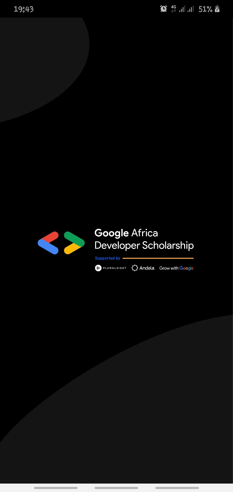
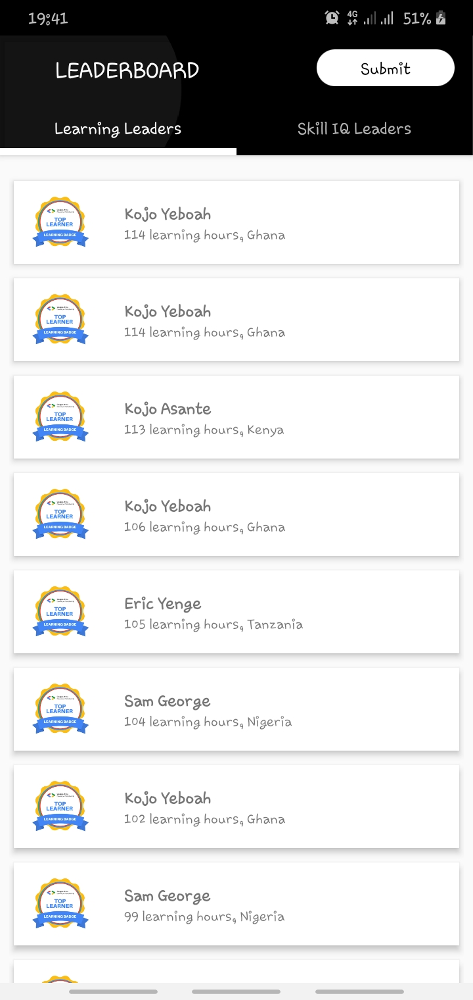
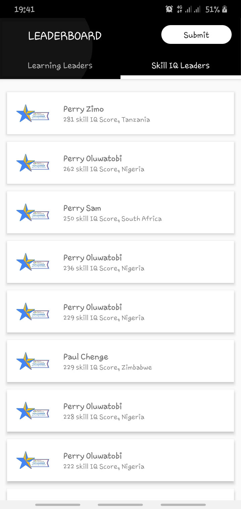
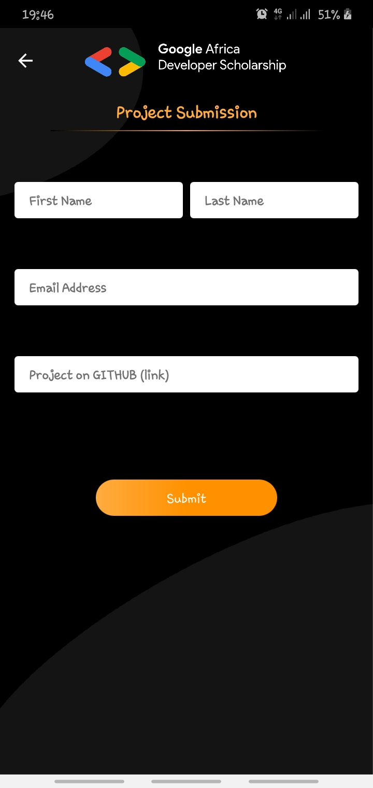

0

  <h3 align="center">GAADS ANDROID PRACTICE PROJECT</h3>
  
  

    Google Africa scholarship practice test.  
   And extra description.
     
     
     
    

 

### Table of contents

**1 [About the App](#about-the-app)** 
**2 [General Preview](#general-preview)** 
**3 [Technical](#technical)** 
**4 [Work in Progress](#work-in-progress)** 
**5 [Contributing](#contributing)** 
**6 [Versions](#versions)** 
**7 [Contributers](#contributers)** 

:point_down: :point_down: :point_down: :point_down: :point_down:

## About the app

Google Africa scholarship practice test phase 2. Android application built with Kotlin to display a LeaderBoard of top learners and top skill iq learners.

## General Preview
#### Screenshots of the app

 

##### Learners:

##### Or Skills:

##### Submit Project:
 

## Technical
## Permissions

1. Internet

### TECHNICAL

#### How to use

**1. Required to run project:**
       ` - To run this project use Android studio 3.* and later. It will be less messy.
         - Gradle version used: gradle 4.0. You can use multiple gradle versions vby having them stored offline. [You can read this to set it up.](www.sth)
        `

**2. Clone this repository :**
 
         `git clone https://github.com/SammyBloom/GADsLeaderBoard`
         
**3. open Project in Android Studio**

**4. Build Project**

**5. Incase of an error when building project, update your gradle version, Build Tools download**

#### Dependencies
Picasso
Glide
Gson
Timber
RecyclerView
Retrofit

## To Do List

- [x] Multi-Activity 
- [x] View pager
- [x] Customizing Toolbar
- [x] RecyclerView
- [x] Making Network Request
- [x] Working with Google Form
- [x] Api Requests

#### CONTRIBUTING
### Assets

[Resources](https://drive.google.com/drive/folders/1l-huMnFzu0Lh_olBCzHgovsUCwbKouMb)

### Want to contribute?
I would/ We'd love to have your help in making  **{this app (replace with name of your project)}** better. The project is still very incomplete, but if there's an issue you'd like to see addressed sooner rather than later, let me(/us) know. 

For any concerns, please open an [issue{edit this}](https://github.com/SammyBloom/GADsLeaderBoard/issues), or JUST, [fork the project and send a pull request{edit this}](https://github.com/YourUserNameHere/ProjectName/pulls). 

## Versions 
* Version 1.0  DATE 11/9/2020

## Contributors
For personal feedback or questions feel free to contact me via the mail address, which is mentioned on my [Github profile](link (https://github.com/SammyBloom). If you have found any bugs or want to post a feature request please use the [bugtracker](https://github.com/SammyBloom/GADsLeaderBoard/issues) to report them.

#### Developer
* e-mail: nwachiemi@gmail.com
* Twitter: [@SCNBloom_](https://twitter.com/SCNBloom "SCNBloom")

